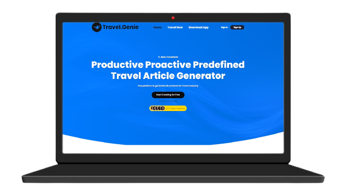
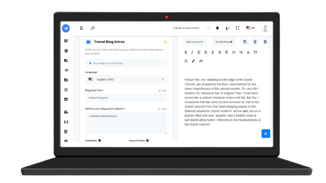
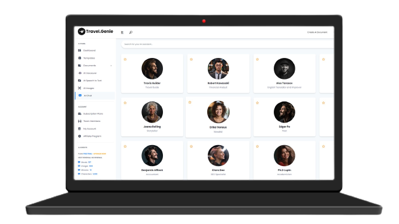
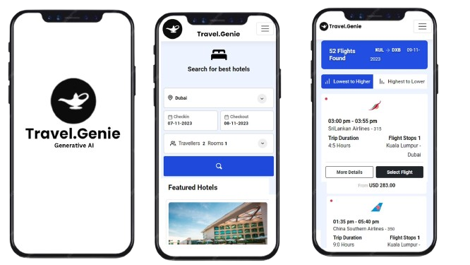

# TravelGenie - Generative AI 
A Generative AI Powered Platform for Travel App & Publishing Industry.

# [Visit Deployed Site Here](https://hackout.teamcode.tech/)  
UserID: user@gmail.com 
Password: user@gmail.com    |   AdminID: admin@gmail.com
Password: admin@gmail.com

## Problem it Solves

- Planning of  travel and preparation of travel iteniary with detailed nuances.
- Giving essential summary and assisting the user with Generative AI Chatbots.
- Empowering publising and creator space for travel domain by proving all type of content generation for blogs, videos with copyright free assets.

### AI Feature of Travel.Genie
- Summarization, PDf chat with Langchain, Curated guide from Generative AI.
- Create templates and generate content from fine tuned LLMs for specific domain.
- Get transcipt for Youtube Video with maximum accuracy.
- Speech Syntesis with Human tones.
- Royalty free high quatilty image generation with positive and negative prompting
- create User Profile, with subscription plans
- And many more
### Basic Features
- Book rentals, flights, tour packages.
- Explore various categories of Hotels, Places and destinations.
- Search and get the curated results of places based on ratings, price aggregator.
- Apply various filters to get desired result.

### PoC UI [ Travel.Genie Creator Web App + Travel App] 
<pre>

</pre>

<pre>

</pre>

## Challenges we faced
- Creating engaing UI for Travel.Genie
- Using Fine tuned custom LLM models
- Prompt engineering to control responses
- Integrating multimodal features to one platform
- Database Desgin to handle all assets
- Providing enterprise features of shared workspace
- Gathering the data of categories as such hotels, restaurants, dineouts, beachers, etc.
- Building the database for co-ordinates(latitude and Longitude) of the places.
- Fetching reviews and ratings.
- Plaing the searching parameters.
- integrating multiple 3rd party services like maps, booking sites was the trickiest part.

## Proposed Enhancements
- Creating pipeline between vendor app and Travel.Genie AI.
- integrating ride booking.
- Live in-app events.
- Support for connecting chain on institutions.

### Contributors
- Aman Gupta 
- Shashank Kumar
- Prakhar Singh
- Prarthana Agrawal

Built with ❤️ by Team C.O.D.E  
At Hackout 2023, DTU
